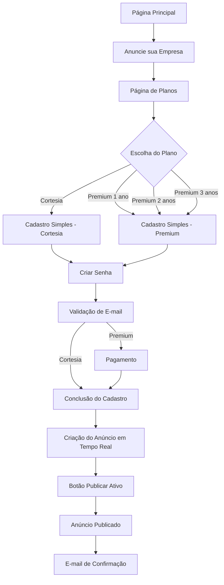

// Local desse arquivo: GFauto/app/cadastro
# README_fluxo_cadastro.md (ok)

**Módulo de Cadastro e Autenticação - Projeto GFauto**  
**Data de Criação:** 04/07/2025  
**Responsável:** Desenvolvedor sob orientação de Weber  
**Baseado em:** Estudo.md e diretrizes do MEMORIADESESSAO.md

---

## 🎯 OBJETIVO DO FLUXO

O **app/cadastro** é responsável por gerenciar todo o processo de cadastro de novos anunciantes, autenticação de usuários existentes e validação de dados no Projeto GFauto.

### **Funcionalidades Principais:**
- Escolha do Plano, app/planos
- *Cadastro simples* de novos anunciantes (Cortesia e Premium)
- Sistema de login e autenticação (ao logar aparece as opções para direcioná- lo: Novo anúncio - atualizar dados - efetuar pagto - status pagto, etc
- Validação da senha por e-mail obrigatória
- Redirecionamento inteligente baseado no plano escolhido
- *conclusão do cadastro* para Cortesia e para Premium → Publicar
- Gestão de sessões de usuário

---

## 🔄 FLUXO DE CADASTRO

2. **Fluxo do Anunciante**
Planos → Cadastro Simples (+ plano) → Criar Senha → Validar E-mail → Conclusão Cadastro → Anúncio em Tempo Real → Publicar
   - Orígem: https://gfauto.vercel.app/   (após clicar em "Anuncie sua Empresa" vai para "planos" https://gfauto.vercel.app/planos qualquer dos planos escolhidos, 1 ano, 2 anos e 3 anos vai para o "cadastro simples" levando a informação do plano clicado para saber quanto vai pagar e segue o fluxo.)
   - Escolha do Plano (**Premium** → *cadastro simples* (nome do responsável, cpf, principal e-mail e Celular de Contato) e login → pagtos (com a informação do valor do Plano vai para o pagamento → *conclusão do cadastro* (Razão Social, Nome de Fantasia, CNPJ, nome do responsável (já vem preenchido do cadastro simples), cpf (também já vem preenchido) Celular de Contato (também já vem preenchido), Endereço da Empresa, Bairro, CEP, Cidade, Estado, Seu Cargo), inserir imagem).  → *criação e ativação (botão "Publicar") do anúncio* (deve ser na mesma página *conclusão do cadastro* pois o anúncio vai sendo preenchido conforme o anunciante informa os dados da *conclusão do cadastro*.  | **Cortesia** → *cadastro simples* (nome do responsável, cpf, principal e-mail e telefone) e login → *conclusão do cadastro* (Razão Social, Nome de Fantasia, CNPJ, nome do responsável (já vem preenchido do cadastro simples), cpf (também já vem preenchido) Celular de Contato (também já vem preenchido), Endereço da Empresa, Bairro, CEP, Cidade, Estado, Seu Cargo) criação e ativação (botão "publicar") do anúncio)
== Anúncio Premium modelo: página: https://gfauto.vercel.app/plano logo depois da frase "Como seu anúncio vai aparecer". (o anunciante vai optar através de checkbox no formulário qual ele quer que figure Razão Social ou Nome de Fantasia).
== Anúncio Cortesia modelo: página: https://gfauto.vercel.app/plano logo depois das amostras de Anúncios Premium. Vai figurar a Razão Social ou Nome de Fantasia e endereço completo. (o anunciante vai optar através de checkbox no formulário qual ele quer que figure).

Obs.: 1. Nome da empresa: 
- "Razão Social": (Na tabela: razaoSocial) - Cia Brasileira de Petróleo e Gás S/A (Registrado no documento oficial da empresa-CNPJ)
- "Nome de Fantasia": (Na tabela: nomeFantasia) - PETROGASA (Vai na Propaganda da Empresa)
O visitante vai informar no formulário os dois, mas só um ( x ) vai para o anúncio)
2. "Nome do Responsável"; quem é responsável pelo anúncio da empresa (Na tabela: nomeResponsavel)
3. Só um, vamos ficar com "Celular de Contato": (na tabela: celContato)
Lembre-se que quando ele vai para o cadastro simples já tem que registrar no DB o plano escolhido e depois do "cadastro simples" ele irá criar a senha e validar, (apenas usuários com senhas e anúncio ativo poderão fazer login no futuro e para verificar exclusivamente a área do seu anúncio) só então vai para criar o anúncio. 
Se for positivo para você, já pode criar/desenhar o "fluxo completo de cadastro" para não esquecermos de nada.
Você entendeu bem a parte em que conforme o anunciante vai preenchendo a "conclusão do cadastro" já vai aparecendo mais abaixo o anúncio formado para depois ele publicar?
1. No cadastro simples, salvamos: nomeResponsavel, cpf, email, celContato, senha, planoEscolhido - correto?
Quando o anunciante chega nessa página é porque ele clicou em um plano escolhido (talvez dê para pegar daí a informação e mesmo assim pedir para ele confirmar o plano). A senha ele vai gerar e confirmar.
2. Na conclusão, completamos: razaoSocial, nomeFantasia, cnpj, enderecoEmpresa, bairro, cep, cidade, estado, cargo, imagemUrl - correto?
Sim. Ele vai mostrar todos mas faltando preencher só estes que não estavam no cadastro simples. E mais os do print pagina6.jpg (ilustrativo): Especialidade, Slogan, Descrição, (obs.: vem do cadastro simples um celular, vamos botar a opção de ele informar o segundo, opcional), O endereço ele vai informar pelos campos (Endereço da Empresa" Rua, número e complemento, Bairro, CEP, Cidade, Estado. 
Lembrando que esses anúncios irão figurar na página de resultado quando o visitante fizer a busca por Estado, Cidade e "O que Procura?" na página principal https://gfauto.vercel.app/ . (conforme ele vai informando os dados serão inseridos no DB e mostrados no modelo que vai sendo construído)
3. Campo para escolha do nome no anúncio - preciso de um campo tipo nomeParaAnuncio (razaoSocial ou nomeFantasia)?
Acho que é por aí mesmo.
4. Validação de e-mail acontece entre criar senha e conclusão do cadastro?
Sim
5. Para Premium, o pagamento acontece ANTES ou DEPOIS da conclusão do cadastro?
O anunciante escolheu o plano "premium", → então vai para "cadastro simples" onde obterá o login e senha e confirmação do e-mail → e vai para o pagto. → conclusão do cadastro e criação do anúncio → quando estiver tudo pronto ativa o botão "publicar" (verde negrito). 

# FLUXO COMPLETO DE CADASTRO - GFAUTO

## 🎯 VISÃO GERAL DO FLUXO



## 📋 DETALHAMENTO POR ETAPA

### **ETAPA 1: ENTRADA NO SISTEMA**
```
URL: https://gfauto.vercel.app/
↓ Clique em "Anuncie sua Empresa"
URL: https://gfauto.vercel.app/planos
↓ Escolha do Plano (1, 2 ou 3 anos)
URL: https://gfauto.vercel.app/cadastro?plano=premium&anos=2
```

### **ETAPA 2: CADASTRO SIMPLES**
**Campos obrigatórios:**
- ✅ **Nome do Responsável** → `nomeResponsavel`
- ✅ **CPF** → `cpf`
- ✅ **Seu Principal E-mail** → `email`
- ✅ **Celular de Contato** → `celContato`
- ✅ **Plano Escolhido** → `planoEscolhido` (vem da URL + confirmação)

**Salvos no DB:** Dados básicos + status "cadastro_simples"

### **ETAPA 3: CRIAÇÃO DE SENHA**
**Campos:**
- ✅ **Senha** (mínimo 8 caracteres, 1 maiúscula, 1 minúscula, 1 especial)
- ✅ **Confirmar Senha**

**Salvos no DB:** `senha` (hash bcrypt) + status "senha_criada"

### **ETAPA 4: VALIDAÇÃO DE E-MAIL**
**Processo:**
- ✅ Envio de e-mail com link de confirmação
- ✅ Usuário clica no link
- ✅ E-mail marcado como verificado

**Salvos no DB:** `emailVerificado = true` + status "email_verificado"

### **ETAPA 5A: PAGAMENTO (APENAS PREMIUM)**
**Processo:**
- ✅ Redirecionamento para página de pagamento
- ✅ Processamento do pagamento
- ✅ Confirmação de pagamento

**Salvos no DB:** Registro na tabela `Payment` + status "pagamento_aprovado"

### **ETAPA 5B: CONCLUSÃO DO CADASTRO**
**Campos da Empresa:**
- ✅ **Razão Social** → `razaoSocial`
- ✅ **Nome de Fantasia** → `nomeFantasia`
- ✅ **CNPJ** → `cnpj`
- ✅ **Seu Cargo** → `cargo`

**Campos do Endereço:**
- ✅ **Endereço da Empresa** → `enderecoEmpresa`
- ✅ **Bairro** → `bairro`
- ✅ **CEP** → `cep`
- ✅ **Cidade** → `cidade`
- ✅ **Estado** → `estado`

**Campos do Anúncio:**
- ✅ **Especialidade** → `especialidade`
- ✅ **Slogan** → `slogan`
- ✅ **Descrição** → `descricao`
- ✅ **Segundo Celular** → `celContato2` (opcional)
- ✅ **Inserir Imagem** → `imagemUrl`

**Escolha para o Anúncio:**
- ✅ **Nome no Anúncio** → `nomeParaAnuncio` (checkbox: razaoSocial ou nomeFantasia)

### **ETAPA 6: VISUALIZAÇÃO EM TEMPO REAL**
**Processo:**
- ✅ Conforme preenche os campos → anúncio se forma embaixo
- ✅ Preview dinâmico do anúncio
- ✅ Todos os dados salvos automaticamente no DB
- ✅ Botão "Publicar" fica ativo quando tudo preenchido

### **ETAPA 7: PUBLICAÇÃO**
**Processo:**
- ✅ Clique no botão "Publicar" (verde negrito)
- ✅ Anúncio criado na tabela `Anuncio`
- ✅ Status alterado para "anuncio_ativo"
- ✅ Anúncio aparece nos resultados de busca

### **ETAPA 8: CONFIRMAÇÃO**
**Processo:**
- ✅ E-mail de parabenização enviado
- ✅ Link para visualizar o anúncio
- ✅ Instruções de acesso ao painel

## 🗃️ ESTRUTURA DO BANCO DE DADOS

### **TABELA ADVERTISER (ATUALIZADA)**
```sql
CREATE TABLE "Advertiser" (
  id                TEXT PRIMARY KEY,
  
  -- DADOS BÁSICOS (Cadastro Simples)
  email             TEXT UNIQUE NOT NULL,
  nomeResponsavel   TEXT NOT NULL,
  cpf               TEXT NOT NULL,
  celContato        TEXT NOT NULL,
  senha             TEXT NOT NULL,
  planoEscolhido    TEXT NOT NULL, -- 'cortesia', 'premium_1ano', 'premium_2anos', 'premium_3anos'
  
  -- DADOS DA EMPRESA (Conclusão)
  razaoSocial       TEXT,
  nomeFantasia      TEXT,
  cnpj              TEXT,
  cargo             TEXT,
  
  -- ENDEREÇO
  enderecoEmpresa   TEXT,
  bairro            TEXT,
  cep               TEXT,
  cidade            TEXT,
  estado            TEXT,
  
  -- DADOS DO ANÚNCIO
  especialidade     TEXT,
  slogan            TEXT,
  descricao         TEXT,
  celContato2       TEXT, -- Segundo celular (opcional)
  imagemUrl         TEXT,
  nomeParaAnuncio   TEXT, -- 'razaoSocial' ou 'nomeFantasia'
  
  -- CONTROLE
  emailVerificado   BOOLEAN DEFAULT false,
  statusCadastro    TEXT DEFAULT 'cadastro_simples', -- 'cadastro_simples', 'senha_criada', 'email_verificado', 'pagamento_aprovado', 'anuncio_ativo'
  createdAt         TIMESTAMP DEFAULT now(),
  updatedAt         TIMESTAMP DEFAULT now()
);
```

## 🔄 FLUXOS POR TIPO DE PLANO

### **CORTESIA:**
```
Planos → Cadastro Simples → Senha → E-mail → Conclusão → Anúncio → Publicar
```

### **PREMIUM:**
```
Planos → Cadastro Simples → Senha → E-mail → Pagamento → Conclusão → Anúncio → Publicar
```

## 📱 INTEGRAÇÃO COM BUSCA

**Os anúncios aparecerão na busca por:**
- ✅ **Estado** (campo `estado`)
- ✅ **Cidade** (campo `cidade`)
- ✅ **Especialidade** (campo `especialidade`)

**Dados exibidos no resultado:**
- ✅ **Nome:** `nomeParaAnuncio` (razaoSocial ou nomeFantasia)
- ✅ **Especialidade:** `especialidade`
- ✅ **Slogan:** `slogan`
- ✅ **Descrição:** `descricao`
- ✅ **Contato:** `celContato` + `celContato2` (se preenchido)
- ✅ **Endereço:** `enderecoEmpresa`, `bairro`, `cidade`, `estado`
- ✅ **Imagem:** `imagemUrl`

## 🎯 PONTOS CRÍTICOS

### **SALVAMENTO AUTOMÁTICO:**
- ✅ Dados salvos a cada campo preenchido
- ✅ Preview atualizado em tempo real
- ✅ Não perde dados se sair da página

### **VALIDAÇÕES:**
- ✅ E-mail único por especialidade
- ✅ CNPJ único por especialidade
- ✅ CPF válido
- ✅ Campos obrigatórios destacados

### **SEGURANÇA:**
- ✅ Senha hasheada com bcrypt
- ✅ Validação de e-mail obrigatória
- ✅ Sessões seguras
- ✅ Proteção contra spam

---

**Fluxo criado por:** Manus AI  
**Baseado em:** README_cadastro.md + esclarecimentos de Weber  
**Data:** 11/07/2025  
**Status:** Pronto para implementação

### **ENTRADA NO SISTEMA:**
```
Página Principal → "Anuncie sua Empresa" → Página de Planos → Escolha do Plano → CADASTRO
```

### **FLUXOS POR TIPO DE PLANO:**

#### **CORTESIA (Gratuito):**
```
1. Página de Planos (/planos?plano=cortesia)
2. Cadastro simples (/cadastro?plano=cortesia)
3. Sistema Login e autenticação (criar)
4. Validação de E-mail
5. Conclusão do cadastro Dados do Anúncio (/anunciante/criar) (com visualização prévia)
6. Publicação Imediata  - link para conferir.
7. E-mail de Confirmação/Parabenização
```

#### **PREMIUM (Pago):**
```
1. Página de Planos (/planos?plano=premium)
2. Cadastro (/cadastro?plano=premium)
3. Validação de E-mail
4. Pagamento (/pagamento) ← LÓGICA WEBER: Pagar antes de criar anúncio
5. Conclusão do cadastro Dados do Anúncio (/anuncio/criar) (com visualização prévia)
6. Publicação Imediata Condicionada ao Pagamento - link para conferir
7. E-mail de Confirmação/Parabenização
```

---

## 📋 ESTRUTURA DE DADOS

### **Campos do Formulário de Cadastro (baseado no Estudo.md):**

#### **PARTE 1: Dados Básicos ("cadastro simples" para o Cadastro e Dados de Acesso ( A confirmação do cadastro e login deverá ser feita pelo e-mail do cadastro)
- **Nome do Responsável** (obrigatório)
- **CPF** (obrigatório)
- **Celular de Contato** (obrigatório)
- **Seu Principal E-mail** (obrigatório)
- **Senha** (mínimo 8 caracteres)
- **Confirmar Senha**

#### **PARTE 2: Dados complementares ("conclusão do cadastro") para formar o anúncio que será publicado)

- **Razão Social** (obrigatório)
- **Nome de Fantasia**(obrigatório)
- **CNPJ** (obrigatório)
- **Nome do Responsável** (obrigatório, já puxa da (PARTE 1 informada antes) 
- **CPF** (obrigatório, já puxa da (PARTE 1 informada antes)
- **Celular de Contato** (obrigatório, já puxa da (PARTE 1 informada antes)
- **Seu Principal E-mail** (obrigatório, já puxa da (PARTE 1 informada antes)
- **Endereço da Empresa** (obrigatório)
- **Bairro** (obrigatório)
- **CEP** (obrigatório)
- **Cidade** (obrigatório)
- **Estado** (obrigatório)
- **Seu Cargo** (obrigatório)
- **Inserir Imagem** 

#### **PARTE 3: Criando o Anúncio
- **Novo Anúncio** O "Cortesia" depois do cadastro e logado já vai para "Criar Anúncio" e o "premium" depois do pagamento já vai para "Criar Anúncio", ambos quando chegare na página "Criar Anúncio" ela já estará preenchida com os dados do cadastro faltando (slogam, especialidade, descrição, etc.) ele completar e ver seu anúncio enquanto completa, até clicar em "publicar"

### **Modelo Prisma (Advertiser):** (conferir com Estrutura de Dados e FLUXO COMPLETO DE CADASTRO)
```prisma
model Advertiser {
  id                String    @id @default(cuid())
  email             String    @unique
  nome              String?   // Nome/Razão Social
  empresa           String?   // Nome de Fantasia
  telefone          String?   // Cel. de Contato
  endereco          String?
  cidade            String?
  estado            String?
  cep               String?
  cnpj              String?
  pessoaResponsavel String?
  cpf               String?
  celContato        String?
  cargo             String?
  senha             String    // Hash bcrypt
  planoEscolhido    String?   // 'cortesia' ou 'premium'
  emailVerificado   Boolean   @default(false)
  createdAt         DateTime  @default(now())
  updatedAt         DateTime  @updatedAt
  payments          Payment[]
  anuncios          Anuncio[]
}
```

---

## 🎨 INTERFACE E DESIGN

### **Cabeçalho da Página (baseado em /planos):**
- **Título Principal:** "Anuncie seu serviço/produto automotivo no GFauto" (30% menor que /planos)
- **Título Secundário:** "Faça seu Cadastro" (substitui "Escolha seu Plano")
- **Subtítulo:** "Conecte-se com milhares de clientes que procuram serviços automotivos na sua região" (mantém igual)

### **Layout do Formulário:**
- **Design responsivo** (desktop e mobile)
- **Validação em tempo real** (frontend)
- **Feedback visual** para erros
- **Progress indicator** mostrando plano escolhido
- **Botão principal:** "Criar Cadastro"

### **Estados do Formulário:**
- **Loading:** "Criando Cadastro..."
- **Sucesso:** Redirecionamento automático
- **Erro:** Mensagens específicas por campo

---

## 🔐 VALIDAÇÕES E SEGURANÇA

### **Validações Frontend:**
- **Campos obrigatórios:** (veja: Parte 1 e Parte 2 de Dados complementares
- **Formato de e-mail:** Regex validation
- **Força da senha:** Mínimo 8 caracteres - letras e números no mínimo:1 maiúscula, 1 minúscula e 1 caracter especial [* # & $ ( ! ]
- **Confirmação de senha:** Deve ser igual à senha
- **CNPJ/CPF:** Formato brasileiro 

### **Validações Backend:**
- **E-mail único:** Verificar se já existe no banco para cada especialidade
- **CNPJ único:** Verificar se já existe no banco para cada especialidade
- **Sanitização:** Limpar dados de entrada
- **Hash de senha:** bcrypt com salt
- **Rate limiting:** Prevenir spam de cadastros

### **Segurança:**
- **Senhas hasheadas** com bcrypt
- **Validação de e-mail obrigatória**
- **Sessões seguras** com JWT ou similar
- **Proteção CSRF**

---

## 📧 SISTEMA DE E-MAILS

### **E-mail de Verificação (Resend.com):**
```
Assunto: "Confirme seu e-mail - GFauto"
Conteúdo:
- Boas-vindas ao GFauto
- Link de confirmação
- Instruções claras
- Suporte de contato
```

### **E-mail de Boas-vindas (pós-confirmação):**
```
Assunto: "Bem-vindo ao GFauto!"
Conteúdo:
- Confirmação de cadastro
- Próximos passos baseados no plano
- Links úteis (painel, suporte)
```

---

## 🔄 REDIRECIONAMENTOS

### **Após Cadastro Bem-sucedido:**

#### **CORTESIA:**
```
/cadastro → Validação E-mail → /anuncio/criar?advertiser_id={id}
```

#### **PREMIUM:**
```
/cadastro → Validação E-mail → /pagamento?advertiser_id={id} → /anuncio/criar?advertiser_id={id}
```

### **Usuários Existentes (Login):**
```
/login → Dashboard Pessoal → Opções:
├── Criar Novo Anúncio
├── Gerenciar Anúncios Existentes
├── Atualizar Dados Cadastrais
├── Renovar Plano
└── Upgrade para Premium
```

---

## 🛠️ ARQUIVOS E COMPONENTES

### **Estrutura do Módulo:**
```
app/cadastro/
├── components/
│   ├── CadastroForm.tsx           # Formulário principal
│   ├── LoginForm.tsx              # Formulário de login
│   ├── EmailVerification.tsx      # Componente de verificação
│   └── PasswordStrength.tsx       # Indicador de força da senha
├── pages/
│   ├── cadastro.tsx               # Página de cadastro
│   ├── login.tsx                  # Página de login
│   └── verificar-email.tsx        # Página de verificação
├── styles/
│   └── cadastro.module.css        # Estilos específicos
└── README_cadastro.md       # Este arquivo
``` 

### **APIs Necessárias:**
```
app/api/
├── cadastro/route.ts              # POST - Criar novo cadastro
├── login/route.ts                 # POST - Autenticar usuário
├── verificar-email/route.ts       # GET - Confirmar e-mail
└── resend-verification/route.ts   # POST - Reenviar verificação
```

---

## 📊 MÉTRICAS E MONITORAMENTO

### **KPIs do Fluxo de Cadastro:**
- **Taxa de conversão:** Visitantes → Cadastros
- **Taxa de verificação:** Cadastros → E-mails verificados
- **Taxa de abandono:** Por etapa do processo
- **Tempo médio:** Para completar cadastro
- **Erros mais comuns:** Validações que falham

### **Logs Importantes:**
- Tentativas de cadastro
- E-mails duplicados
- Falhas de validação
- Problemas de envio de e-mail

---

## 🚨 TRATAMENTO DE ERROS

### **Erros Comuns e Soluções:**

#### **E-mail já cadastrado:**
```
Mensagem: "Este e-mail já está cadastrado. Deseja fazer login?"
Ação: Link para página de login
```

#### **Falha no envio de e-mail:**
```
Mensagem: "Cadastro criado, mas houve problema no envio do e-mail de verificação."
Ação: Botão "Reenviar E-mail"
```

#### **Dados inválidos:**
```
Mensagem: Específica por campo
Ação: Destacar campo com erro
```

---

## 🔄 INTEGRAÇÃO COM OUTROS FLUXOS

### **app/pagtos:**
- Recebe `advertiser_id` após cadastro premium
- Processa pagamento antes de criar anúncio

### **app/anunciante:**
- Recebe `advertiser_id` após cadastro/pagamento
- Cria anúncio vinculado ao anunciante

### **fluxo_email:** (verificar onde vai ficar na estrutura)
- Envia e-mails de verificação
- Envia e-mails de boas-vindas
- Notificações de status

---

## 📝 PRÓXIMOS PASSOS

### **Implementação Imediata:**
1. **Criar página de cadastro** (`/cadastro`)
2. **Implementar API de cadastro** (`/api/cadastro`)
3. **Sistema de validação de e-mail**
4. **Página de login** (`/login`)
5. **Integração com Resend.com**

### **Melhorias Futuras:**
- **Login social** (Google, Facebook)
- ****Recuperação de senha** (a partir do primeiro cadastro já precisa existir a possibilidade).
- **Autenticação de dois fatores**
- **Dashboard personalizado**

---

## 🎯 CRITÉRIOS DE SUCESSO

### **Funcional:**
- [x] Cadastro funciona para cortesia e premium
- [x] Validação de e-mail obrigatória
- [x] Redirecionamento correto por plano
- [x] Login de usuários existentes
- [x] Integração com outros fluxos

### **Técnico:**
- [x] Validações frontend e backend
- [x] Segurança de senhas
- [x] Performance adequada
- [x] Responsividade mobile

### **UX/UI:**
- [x] Interface intuitiva
- [x] Feedback claro de erros
- [x] Processo fluido
- [x] Design consistente

---

## 📞 SUPORTE E MANUTENÇÃO

### **Logs de Debug:**
- Todos os cadastros são logados
- Erros de validação registrados
- Problemas de e-mail monitorados

### **Backup de Dados:**
- Dados de cadastro em backup diário
- Senhas nunca em logs
- Conformidade com LGPD

---

**Documento criado por:** Desenvolvedor  
**Baseado em:** Estudo.md, MEMORIADESESSAO.md e diretrizes de Weber  
**Próxima ação:** Implementar página de cadastro  
**Status:** Pronto para desenvolvimento

---

**⚠️ IMPORTANTE:** Este fluxo é crítico para conversão. Qualquer alteração deve ser testada cuidadosamente e aprovada por Weber antes da implementação.

