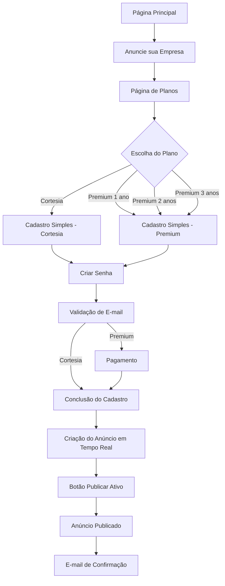

# 🚀 PLANO MAIOR DEFINITIVO - PROJETO GFAUTO (ok)

**Documento Oficial de Planejamento e Execução**  
**Data de Criação:** 04/07/2025  
**Versão:** 1.0 - Definitiva  
**Autor:** Manus (Desenvolvedor) sob orientação de Weber  

---

## 📋 ÍNDICE

1. [Visão Geral do Projeto](#visão-geral-do-projeto)
2. [Situação Atual Identificada](#situação-atual-identificada)
3. [Arquitetura e Tecnologias](#arquitetura-e-tecnologias)
4. [Estrutura do Banco de Dados](#estrutura-do-banco-de-dados)
5. [Análise dos Ambientes](#análise-dos-ambientes)
6. [Plano de Consolidação](#plano-de-consolidação)
7. [Cronograma de Execução](#cronograma-de-execução)
8. [Especificações Técnicas](#especificações-técnicas)
9. [Gestão de Riscos](#gestão-de-riscos)
10. [Controle de Qualidade](#controle-de-qualidade)
11. [Próximos Passos](#próximos-passos)

---

## 🎯 VISÃO GERAL DO PROJETO

### **Objetivo Principal**
O Projeto GFauto é uma plataforma web que conecta proprietários de veículos automotores a fornecedores especializados do ramo automotivo no Brasil, facilitando a busca por serviços e permitindo que empresas sejam encontradas pelos clientes.

### **Proposta de Valor**
- **Para Visitantes:** Encontrar facilmente serviços automotivos na sua cidade
- **Para Anunciantes:** Ser encontrado por clientes potenciais com exposição diferenciada
- **Modelo de Negócio:** Anúncios gratuitos (Cortesia) e pagos (Premium) com exposição privilegiada

### **URLs do Projeto**
- **Produção Atual:** https://gfauto.vercel.app/
- **Repositório GitHub:** https://github.com/RLuizWeber/GFauto.git
- **Banco de Dados:** Vercel Postgres (Neon) - Conectado via DBeaver
---

## 📊 SITUAÇÃO ATUAL IDENTIFICADA

### **🔍 Descoberta Crítica**
Através da análise do banco de dados via DBeaver, identificamos que o Projeto GFauto **NÃO É UM PROJETO NOVO**, mas sim um **SISTEMA EM TESTE** populado com dados fictícios:

#### **Dados Existentes no Banco:** (rever dados para confirmar)
- **Advertiser:** 24.000 registros (anunciantes)
- **Anuncio:** 48.000 registros (anúncios)
- **Payment:** 32.000 registros (pagamentos)
- **cidades:** 24.000 registros (cidades brasileiras)
- **especialidades:** 16.000 registros (especialidades automotivas)
- **estados:** 16.000 registros (estados do Brasil)
- **imagens_anuncio:** 16.000 registros (imagens dos anúncios)
- **rotacao_premium:** 24.000 registros (sistema de rotação premium)

### **🚨 Implicações Desta Descoberta**
1. **Estratégia:** Desenvolvimento para consolidação, otimização e entrada e produção
2. **Preservação de Dados:** Todos os dados existentes devem ser mantidos enquanto estiver sendo desenvolvido
3. **Cuidados:** Ajustes nos repositórios sem perda de informações
4. **Sistema Funcional:** Já existe um sistema operacional que precisa ser aprimorado

---

## 🏗️ ARQUITETURA E TECNOLOGIAS

### **Stack Tecnológico Atual**
- **Frontend:** Next.js 14+ (App Router), React, TypeScript, TailwindCSS
- **Backend:** Next.js API Routes, Prisma ORM
- **Banco de Dados:** PostgreSQL (Vercel Postgres/Neon)
- **Hospedagem:** Vercel.com (deploy automático via GitHub)
- **Autenticação:** Senha forte + 2FA para painel admin
- **Pagamentos:** Mercado Pago (integração funcional)
- **E-mail:** Resend (domínio gfauto.com.br verificado)

### **Estrutura Modular**
O projeto está organizado em módulos (app/planos, pagtos, cadastro, etc)  independentes: Obs.: Os que tem a palavra "fluxo_" terão que ser ajustados mais adiante.
Gfauto/app/
- **fluxo_app:** Página principal e navegação (esse tem que migrar para app/)
- **anunciante:** Gestão de anunciantes
- **resultados:** Página de resultados de busca
- **pagtos:** Sistema de pagamentos
- **fluxo_painel_admin:** Painel administrativo (descobrir onde está e migrar para app/)
- **planos:** Gestão de planos de anúncios
- **fluxo_visitante:** Experiência do usuário visitante (esse tem que migrar para app/)

---

## 🗄️ ESTRUTURA DO BANCO DE DADOS

### **Schema Atual (Prisma)**

#### **1. Advertiser (Anunciante)**
```prisma
model Advertiser {
  id          String    @id @default(cuid())
  email       String    @unique
  nome        String?
  telefone    String?
  empresa     String?
  endereco    String?
  cidade      String?
  estado      String?
  cep         String?
  createdAt   DateTime  @default(now())
  updatedAt   DateTime  @updatedAt
  payments    Payment[]
  anuncios    Anuncio[]
}
```

#### **2. Payment (Pagamento)**
```prisma
model Payment {
  id                    String         @id @default(cuid())
  mercadopagoPaymentId  String?        @unique
  mercadopagoPreferenceId String?      @unique
  status                StatusPagamento
  amount                Float
  currency              String         @default("BRL")
  paymentMethod         String?
  advertiserId          String
  advertiser            Advertiser     @relation(fields: [advertiserId], references: [id])
  createdAt             DateTime       @default(now())
  updatedAt             DateTime       @updatedAt
  anuncio               Anuncio?
}
```

#### **3. Anuncio (Anúncio)**
```prisma
model Anuncio {
  id                      String         @id @default(cuid())
  advertiserId            String
  advertiser              Advertiser     @relation(fields: [advertiserId], references: [id])
  mercadopagoPreferenceId String?        @unique
  status                  StatusAnuncio
  tituloPlano             String?
  createdAt               DateTime       @default(now())
  updatedAt               DateTime       @updatedAt
  payment                 Payment?       @relation(name: "PaymentToAnuncio")
}
```

#### **4. Enums de Status**
```prisma
enum StatusPagamento {
  PENDENTE
  APROVADO
  REJEITADO
  CANCELADO
  REEMBOLSADO
}

enum StatusAnuncio {
  AGUARDANDO_PAGAMENTO
  AGUARDANDO_CADASTRO
  PUBLICADO
  PAGAMENTO_PROBLEMA
  REEMBOLSADO_POS_PUBLICACAO
  SUSPENSO_CHARGEBACK
  SUSPENSO_ADMIN
  EXPIRADO
}
```

### **Tabelas de Apoio**
- **cidades:** Cidades brasileiras com relacionamento estado
- **estados:** Estados do Brasil
- **especialidades:** Especialidades automotivas disponíveis
- **especialidades_disponiveis:** Mapeamento de especialidades ativas
- **imagens_anuncio:** Imagens associadas aos anúncios
- **rotacao_premium:** Sistema de rotação de anúncios premium

---

## 🌐 ANÁLISE DOS AMBIENTES

### **1. Ambiente "Meu Local" (Weber)**
- **Localização:** W:\A_Weber\Pai\Hostmachine\gfauto\githubVercel\
- **Estrutura:** 
  - `GFauto/` - Repositório principal
  - `gfauto-repo/` - Versão com funcionalidades adicionais (a ser consolidada)
  - `corrigir/` - Scripts de correção e deploy

### **2. Repositório GitHub Principal**
- **URL:** https://github.com/RLuizWeber/GFauto
- **Commits:** 284 commits
- **Estrutura Organizada:** Fluxos separados, documentação, backups
- **Status:** Ativo, versão mais madura

### **3. Repositório Temporário (Para Análise)**
- **URL:** https://github.com/RLuizWeber/gfauto-repo_01_soNoGitHub
- **Commits:** 91 commits
- **Funcionalidades Importantes:** Painel admin completo, sistema de pagamentos
- **Status:** Temporário, será eliminado após consolidação

### **4. Ambiente Vercel (Produção)**
- **URL:** https://gfauto.vercel.app/  (fluxo_app)
- **Deploy:** Automático via GitHub
- **Banco:** Conectado ao Neon PostgreSQL
- **Status:** Produção ativa populado com dados ficticios
- Outras páginas na vercel:
- https://gfauto.vercel.app/admin/dashboard
- https://gfauto.vercel.app/planos (fluxo_plano)
---

## 🔄 PLANO DE CONSOLIDAÇÃO

### **FASE 1: PREPARAÇÃO E BACKUP (2-3 dias)**

#### **Objetivos:**
- Garantir segurança total dos dados existentes
- Mapear diferenças entre repositórios
- Preparar ambiente para migração

#### **Atividades:**
1. **Backup Completo do Banco de Dados**
   - Export completo via DBeaver
   - Backup das tabelas críticas (Advertiser, Payment, Anuncio)
   - Verificação da integridade dos dados

2. **Backup do Repositório Principal**
   - Clone completo do GFauto
   - Backup da pasta backups/ existente
   - Documentação do estado atual

3. **Análise Comparativa Detalhada**
   - Mapeamento arquivo por arquivo
   - Identificação de conflitos
   - Lista de funcionalidades únicas em cada repositório

#### **Entregáveis:**
- Backup completo do banco de dados
- Relatório de análise comparativa
- Plano detalhado de migração

### **FASE 2: MIGRAÇÃO SELETIVA (5-7 dias)**

#### **Objetivos:**
- Migrar funcionalidades importantes do gfauto-repo para GFauto
- Manter integridade do sistema principal
- Preservar todas as funcionalidades existentes

#### **Atividades:**

##### **2.1 Migração do Painel Administrativo**
```
ORIGEM: gfauto-repo/app/admin/
DESTINO: GFauto/app/admin/
STATUS: Funcionalidade parece não existir no GFauto principal => (Verificar em GFauto/app/)
AÇÃO: Migração completa
```

**Componentes a migrar:**
- Dashboard administrativo
- Gestão de anúncios
- Gestão de pagamentos
- Componentes de UI do admin

##### **2.2 Migração das APIs de Pagamento**
```
ORIGEM: gfauto-repo/app/api/
DESTINO: GFauto/app/api/
STATUS: Integração com sistema existente
AÇÃO: Migração e integração
```

**APIs a migrar:**
- `/api/create-payment` - Criação de pagamentos Mercado Pago
- `/api/webhook/mercadopago` - Webhook de notificações
- `/api/send-email` - Envio de e-mails via Resend

##### **2.3 Atualização do Schema do Banco**
```
ORIGEM: gfauto-repo/prisma/schema.prisma
DESTINO: GFauto/prisma/schema.prisma
STATUS: Verificar compatibilidade com dados existentes
AÇÃO: Migração cuidadosa com validação
```

##### **2.4 Migração de Configurações**
```
ORIGEM: gfauto-repo/public/fonts/, .npmrc, next.config.js
DESTINO: GFauto/
STATUS: Otimizações de produção
AÇÃO: Comparar e mesclar
```

#### **Entregáveis:**
- Painel administrativo funcional no GFauto
- APIs de pagamento integradas
- Schema do banco atualizado
- Configurações otimizadas

### **FASE 3: INTEGRAÇÃO E TESTES (3-4 dias)**

#### **Objetivos:**
- Garantir funcionamento completo do sistema consolidado
- Resolver conflitos e dependências
- Validar todas as funcionalidades

#### **Atividades:**
1. **Resolução de Conflitos**
   - Ajuste de imports e paths
   - Resolução de dependências conflitantes
   - Padronização de código

2. **Testes Funcionais**
   - Teste do painel administrativo
   - Validação das APIs de pagamento
   - Verificação da integração Mercado Pago
   - Teste de envio de e-mails

3. **Testes de Integração**
   - Fluxo completo de criação de anúncio
   - Processo de pagamento end-to-end
   - Validação do webhook do Mercado Pago

#### **Entregáveis:**
- Sistema consolidado funcionando
- Relatório de testes
- Documentação atualizada

### **FASE 4: LIMPEZA E FINALIZAÇÃO (1-2 dias)**

#### **Objetivos:**
- Eliminar repositório temporário
- Atualizar documentação
- Finalizar consolidação

#### **Atividades:**
1. **Validação Final**
   - Confirmação de que tudo foi migrado
   - Teste final do sistema completo
   - Verificação de performance

2. **Limpeza**
   - Exclusão do repositório gfauto-repo_01_soNoGitHub
   - Remoção de arquivos temporários
   - Organização da estrutura final

3. **Documentação**
   - Atualização do README_geral.md
   - Atualização dos READMEs específicos
   - Atualização do MEMORIADESESSAO.md

#### **Entregáveis:**
- Sistema consolidado final
- Documentação completa atualizada
- Ambiente limpo e organizado

---

## 📅 CRONOGRAMA DE EXECUÇÃO (dispensado não precisamos, iremos executando conforme nos convier no momento)

### Preparação, Migração Core, Integração, Finalização.
---

## 🔧 ESPECIFICAÇÕES TÉCNICAS

### **Funcionalidades Principais a Manter**

#### **1. Página Principal (fluxo_app)**
- **Layout:** manter como está em https://gfauto.vercel.app/ que foi Inspirado em gfauto.com.br
- **Componentes:** Logo, texto "Uma Proposta Ganha-Ganha", formulário de busca
- **Funcionalidades:** Autocomplete de estados/cidades, validação de campos
- **Responsividade:** Desktop e mobile

#### **2. Sistema de Busca (fluxo_visitante)**
- **Campos:** Estado, Cidade, "O que procura?"
- **Validação:** Cidade obrigatória antes de habilitar busca
- **Mapeamento:** Termos de busca para especialidades
- **Resultado:** Redirecionamento para página de resultados

#### **3. Página de Resultados (app/resultados)**
- **Layout:** Moderno, inspirado nas referências fornecidas
- **Funcionalidades:** Listagem de anunciantes, filtros, paginação
- **Diferenciação:** Anúncios cortesia vs premium

#### **4. Sistema de Pagamentos (app/pagtos)**
- **Integração:** Mercado Pago completa
- **Fluxo:** Criação de preferência → Pagamento → Webhook → Ativação
- **Status:** Controle completo do ciclo de vida do pagamento

#### **5. Painel Administrativo (fluxo_painel_admin)**
- **Funcionalidades:** Dashboard, gestão de anúncios, pagamentos
- **Autenticação:** Senha forte + 2FA
- **Relatórios:** Estatísticas e controles administrativos

### **Integrações Externas**

#### **Mercado Pago**
- **Ambiente:** Produção (credenciais configuradas)
- **Funcionalidades:** Criação de preferências, processamento, webhooks
- **Status:** Testado e funcionando

#### **Resend (E-mail)**
- **Domínio:** gfauto.com.br (verificado)
- **Funcionalidades:** E-mails transacionais, notificações
- **Status:** Configurado e operacional

#### **Vercel Postgres (Neon)**
- **Conexão:** DATABASE_URL configurada conectada via DBeaver
- **Acesso:** DBeaver conectado e acessível via DBeaver no "Meu Local"
- **Status:** Produção com dados fictícios (serão usados só para testar, depois eliminados)

---

## ⚠️ GESTÃO DE RISCOS

### **Riscos Críticos**

#### **1. Perda de Dados (RISCO ALTO)**
- **Descrição:** Perda dos 24K-48K registros existentes (fictícios serão usados só para testar, depois eliminados)
- **Mitigação:** Backup completo antes de qualquer alteração
- **Plano B:** Restore imediato a partir do backup

#### **2. Quebra de Funcionalidades (RISCO ALTO)**
- **Descrição:** Sistema atual parar de funcionar
- **Mitigação:** Testes incrementais, rollback preparado
- **Plano B:** Reversão para versão anterior

#### **3. Conflitos de Dependências (RISCO MÉDIO)**
- **Descrição:** Incompatibilidades entre versões
- **Mitigação:** Análise prévia, testes isolados
- **Plano B:** Resolução manual de conflitos

#### **4. Problemas de Integração (RISCO MÉDIO)**
- **Descrição:** APIs externas pararem de funcionar
- **Mitigação:** Testes de integração completos
- **Plano B:** Reconfiguração das integrações

### **Planos de Contingência**

#### **Rollback Completo**
1. Restore do banco de dados a partir do backup
2. Reversão do código para commit anterior
3. Reconfiguração das variáveis de ambiente
4. Validação do funcionamento

#### **Rollback Parcial**
1. Reversão de funcionalidades específicas
2. Manutenção do core funcionando
3. Correção incremental dos problemas

---

## 🎯 CONTROLE DE QUALIDADE

### **Critérios de Aceitação**

#### **Funcionalidades Obrigatórias**
- [ ] Página principal funcionando completamente
- [ ] Sistema de busca operacional
- [ ] Página de resultados exibindo dados fictícios do DB
- [ ] Painel administrativo acessível e funcional
- [ ] Sistema de pagamentos processando corretamente
- [ ] Integrações externas funcionando
- [ ] Todos os dados preservados

#### **Performance**
- [ ] Tempo de carregamento < 3 segundos
- [ ] Responsividade em dispositivos móveis
- [ ] SEO otimizado
- [ ] Acessibilidade básica

#### **Segurança**
- [ ] Autenticação do admin funcionando
- [ ] Dados sensíveis protegidos
- [ ] Validações de entrada implementadas
- [ ] HTTPS configurado

### **Testes Obrigatórios**

#### **Testes Funcionais**
1. **Fluxo do Visitante**
   - Orígem: https://gfauto.vercel.app/
   - Busca por especialidade (campo: "O que procura?" depois de informar Estado e Cidade e clicar no botão "Buscar Serviços")
   - Navegação para resultados
   - Visualização de anúncios

2. **Fluxo do Anunciante**
Planos → Cadastro Simples (+ plano) → Criar Senha → Validar E-mail → Conclusão Cadastro → Anúncio em Tempo Real → Publicar
   - Orígem: https://gfauto.vercel.app/   (após clicar em "Anuncie sua Empresa" vai para "planos" https://gfauto.vercel.app/planos qualquer dos planos escolhidos, 1 ano, 2 anos e 3 anos vai para o "cadastro simples" levando a informação do plano clicado para saber quanto vai pagar e segue o fluxo.)
   - Escolha do Plano (**Premium** → *cadastro simples* (nome do responsável, cpf, principal e-mail e Celular de Contato) e login → pagtos (com a informação do valor do Plano vai para o pagamento → *conclusão do cadastro* (Razão Social, Nome de Fantasia, CNPJ, nome do responsável (já vem preenchido do cadastro simples), cpf (também já vem preenchido) Celular de Contato (também já vem preenchido), Endereço da Empresa, Bairro, CEP, Cidade, Estado, Seu Cargo), inserir imagem).  → *criação e ativação (botão "Publicar") do anúncio* (deve ser na mesma página *conclusão do cadastro* pois o anúncio vai sendo preenchido conforme o anunciante informa os dados da *conclusão do cadastro*.  | **Cortesia** → *cadastro simples* (nome do responsável, cpf, principal e-mail e telefone) e login → *conclusão do cadastro* (Razão Social, Nome de Fantasia, CNPJ, nome do responsável (já vem preenchido do cadastro simples), cpf (também já vem preenchido) Celular de Contato (também já vem preenchido), Endereço da Empresa, Bairro, CEP, Cidade, Estado, Seu Cargo) criação e ativação (botão "publicar") do anúncio)
== Anúncio Premium modelo: página: https://gfauto.vercel.app/plano logo depois da frase "Como seu anúncio vai aparecer". (o anunciante vai optar através de checkbox no formulário qual ele quer que figure Razão Social ou Nome de Fantasia).
== Anúncio Cortesia modelo: página: https://gfauto.vercel.app/plano logo depois das amostras de Anúncios Premium. Vai figurar a Razão Social ou Nome de Fantasia e endereço completo. (o anunciante vai optar através de checkbox no formulário qual ele quer que figure).

Obs.: 1. Nome da empresa: 
- "Razão Social": (Na tabela: razaoSocial) - Cia Brasileira de Petróleo e Gás S/A (Registrado no documento oficial da empresa-CNPJ)
- "Nome de Fantasia": (Na tabela: nomeFantasia) - PETROGASA (Vai na Propaganda da Empresa)
O visitante vai informar no formulário os dois, mas só um ( x ) vai para o anúncio)
2. "Nome do Responsável"; quem é responsável pelo anúncio da empresa (Na tabela: nomeResponsavel)
3. Só um, vamos ficar com "Celular de Contato": (na tabela: celContato)
Lembre-se que quando ele vai para o cadastro simples já tem que registrar no DB o plano escolhido e depois do "cadastro simples" ele irá criar a senha e validar, (apenas usuários com senhas e anúncio ativo poderão fazer login no futuro e para verificar exclusivamente a área do seu anúncio) só então vai para criar o anúncio. 
Se for positivo para você, já pode criar/desenhar o "fluxo completo de cadastro" para não esquecermos de nada.
Você entendeu bem a parte em que conforme o anunciante vai preenchendo a "conclusão do cadastro" já vai aparecendo mais abaixo o anúncio formado para depois ele publicar?
1. No cadastro simples, salvamos: nomeResponsavel, cpf, email, celContato, senha, planoEscolhido - correto?
Quando o anunciante chega nessa página é porque ele clicou em um plano escolhido (talvez dê para pegar daí a informação e mesmo assim pedir para ele confirmar o plano). A senha ele vai gerar e confirmar.
2. Na conclusão, completamos: razaoSocial, nomeFantasia, cnpj, enderecoEmpresa, bairro, cep, cidade, estado, cargo, imagemUrl - correto?
Sim. Ele vai mostrar todos mas faltando preencher só estes que não estavam no cadastro simples. E mais os do print pagina6.jpg (ilustrativo): Especialidade, Slogan, Descrição, (obs.: vem do cadastro simples um celular, vamos botar a opção de ele informar o segundo, opcional), O endereço ele vai informar pelos campos (Endereço da Empresa" Rua, número e complemento, Bairro, CEP, Cidade, Estado. 
Lembrando que esses anúncios irão figurar na página de resultado quando o visitante fizer a busca por Estado, Cidade e "O que Procura?" na página principal https://gfauto.vercel.app/ . (conforme ele vai informando os dados serão inseridos no DB e mostrados no modelo que vai sendo construído)
3. Campo para escolha do nome no anúncio - preciso de um campo tipo nomeParaAnuncio (razaoSocial ou nomeFantasia)?
Acho que é por aí mesmo.
4. Validação de e-mail acontece entre criar senha e conclusão do cadastro?
Sim
5. Para Premium, o pagamento acontece ANTES ou DEPOIS da conclusão do cadastro?
O anunciante escolheu o plano "premium", → então vai para "cadastro simples" onde obterá o login e senha e confirmação do e-mail → e vai para o pagto. → conclusão do cadastro e criação do anúncio → quando estiver tudo pronto ativa o botão "publicar" (verde negrito). 

# FLUXO COMPLETO DE CADASTRO - GFAUTO

## 🎯 VISÃO GERAL DO FLUXO



## 📋 DETALHAMENTO POR ETAPA

### **ETAPA 1: ENTRADA NO SISTEMA**
```
URL: https://gfauto.vercel.app/
↓ Clique em "Anuncie sua Empresa"
URL: https://gfauto.vercel.app/planos
↓ Escolha do Plano (1, 2 ou 3 anos)
URL: https://gfauto.vercel.app/cadastro?plano=premium&anos=2
```

### **ETAPA 2: CADASTRO SIMPLES**
**Campos obrigatórios:**
- ✅ **Nome do Responsável** → `nomeResponsavel`
- ✅ **CPF** → `cpf`
- ✅ **Seu Principal E-mail** → `email`
- ✅ **Celular de Contato** → `celContato`
- ✅ **Plano Escolhido** → `planoEscolhido` (vem da URL + confirmação)

**Salvos no DB:** Dados básicos + status "cadastro_simples"

### **ETAPA 3: CRIAÇÃO DE SENHA**
**Campos:**
- ✅ **Senha** (mínimo 8 caracteres, 1 maiúscula, 1 minúscula, 1 especial)
- ✅ **Confirmar Senha**

**Salvos no DB:** `senha` (hash bcrypt) + status "senha_criada"

### **ETAPA 4: VALIDAÇÃO DE E-MAIL**
**Processo:**
- ✅ Envio de e-mail com link de confirmação
- ✅ Usuário clica no link
- ✅ E-mail marcado como verificado

**Salvos no DB:** `emailVerificado = true` + status "email_verificado"

### **ETAPA 5A: PAGAMENTO (APENAS PREMIUM)**
**Processo:**
- ✅ Redirecionamento para página de pagamento
- ✅ Processamento do pagamento
- ✅ Confirmação de pagamento

**Salvos no DB:** Registro na tabela `Payment` + status "pagamento_aprovado"

### **ETAPA 5B: CONCLUSÃO DO CADASTRO**
**Campos da Empresa:**
- ✅ **Razão Social** → `razaoSocial`
- ✅ **Nome de Fantasia** → `nomeFantasia`
- ✅ **CNPJ** → `cnpj`
- ✅ **Seu Cargo** → `cargo`

**Campos do Endereço:**
- ✅ **Endereço da Empresa** → `enderecoEmpresa`
- ✅ **Bairro** → `bairro`
- ✅ **CEP** → `cep`
- ✅ **Cidade** → `cidade`
- ✅ **Estado** → `estado`

**Campos do Anúncio:**
- ✅ **Especialidade** → `especialidade`
- ✅ **Slogan** → `slogan`
- ✅ **Descrição** → `descricao`
- ✅ **Segundo Celular** → `celContato2` (opcional)
- ✅ **Inserir Imagem** → `imagemUrl`

**Escolha para o Anúncio:**
- ✅ **Nome no Anúncio** → `nomeParaAnuncio` (checkbox: razaoSocial ou nomeFantasia)

### **ETAPA 6: VISUALIZAÇÃO EM TEMPO REAL**
**Processo:**
- ✅ Conforme preenche os campos → anúncio se forma embaixo
- ✅ Preview dinâmico do anúncio
- ✅ Todos os dados salvos automaticamente no DB
- ✅ Botão "Publicar" fica ativo quando tudo preenchido

### **ETAPA 7: PUBLICAÇÃO**
**Processo:**
- ✅ Clique no botão "Publicar" (verde negrito)
- ✅ Anúncio criado na tabela `Anuncio`
- ✅ Status alterado para "anuncio_ativo"
- ✅ Anúncio aparece nos resultados de busca

### **ETAPA 8: CONFIRMAÇÃO**
**Processo:**
- ✅ E-mail de parabenização enviado
- ✅ Link para visualizar o anúncio
- ✅ Instruções de acesso ao painel

## 🗃️ ESTRUTURA DO BANCO DE DADOS

### **TABELA ADVERTISER (ATUALIZADA)**
```sql
CREATE TABLE "Advertiser" (
  id                TEXT PRIMARY KEY,
  
  -- DADOS BÁSICOS (Cadastro Simples)
  email             TEXT UNIQUE NOT NULL,
  nomeResponsavel   TEXT NOT NULL,
  cpf               TEXT NOT NULL,
  celContato        TEXT NOT NULL,
  senha             TEXT NOT NULL,
  planoEscolhido    TEXT NOT NULL, -- 'cortesia', 'premium_1ano', 'premium_2anos', 'premium_3anos'
  
  -- DADOS DA EMPRESA (Conclusão)
  razaoSocial       TEXT,
  nomeFantasia      TEXT,
  cnpj              TEXT,
  cargo             TEXT,
  
  -- ENDEREÇO
  enderecoEmpresa   TEXT,
  bairro            TEXT,
  cep               TEXT,
  cidade            TEXT,
  estado            TEXT,
  
  -- DADOS DO ANÚNCIO
  especialidade     TEXT,
  slogan            TEXT,
  descricao         TEXT,
  celContato2       TEXT, -- Segundo celular (opcional)
  imagemUrl         TEXT,
  nomeParaAnuncio   TEXT, -- 'razaoSocial' ou 'nomeFantasia'
  
  -- CONTROLE
  emailVerificado   BOOLEAN DEFAULT false,
  statusCadastro    TEXT DEFAULT 'cadastro_simples', -- 'cadastro_simples', 'senha_criada', 'email_verificado', 'pagamento_aprovado', 'anuncio_ativo'
  createdAt         TIMESTAMP DEFAULT now(),
  updatedAt         TIMESTAMP DEFAULT now()
);
```

## 🔄 FLUXOS POR TIPO DE PLANO

### **CORTESIA:**
```
Planos → Cadastro Simples → Senha → E-mail → Conclusão → Anúncio → Publicar
```

### **PREMIUM:**
```
Planos → Cadastro Simples → Senha → E-mail → Pagamento → Conclusão → Anúncio → Publicar
```

## 📱 INTEGRAÇÃO COM BUSCA

**Os anúncios aparecerão na busca por:**
- ✅ **Estado** (campo `estado`)
- ✅ **Cidade** (campo `cidade`)
- ✅ **Especialidade** (campo `especialidade`)

**Dados exibidos no resultado:**
- ✅ **Nome:** `nomeParaAnuncio` (razaoSocial ou nomeFantasia)
- ✅ **Especialidade:** `especialidade`
- ✅ **Slogan:** `slogan`
- ✅ **Descrição:** `descricao`
- ✅ **Contato:** `celContato` + `celContato2` (se preenchido)
- ✅ **Endereço:** `enderecoEmpresa`, `bairro`, `cidade`, `estado`
- ✅ **Imagem:** `imagemUrl`

## 🎯 PONTOS CRÍTICOS

### **SALVAMENTO AUTOMÁTICO:**
- ✅ Dados salvos a cada campo preenchido
- ✅ Preview atualizado em tempo real
- ✅ Não perde dados se sair da página

### **VALIDAÇÕES:**
- ✅ E-mail único por especialidade
- ✅ CNPJ único por especialidade
- ✅ CPF válido
- ✅ Campos obrigatórios destacados

### **SEGURANÇA:**
- ✅ Senha hasheada com bcrypt
- ✅ Validação de e-mail obrigatória
- ✅ Sessões seguras
- ✅ Proteção contra spam

---

**Fluxo criado por:** Manus AI  
**Baseado em:** README_cadastro.md + esclarecimentos de Weber  
**Data:** 11/07/2025  
**Status:** Pronto para implementação 

3. **Fluxo Administrativo**
   - Login no painel
   - Gestão de anúncios
   - Relatórios e estatísticas

#### **Testes de Integração**
1. **Mercado Pago**
   - Criação de preferência
   - Processamento de pagamento
   - Recebimento de webhook

2. **Resend**
   - Envio de e-mails
   - Entrega confirmada
   - Templates funcionando

3. **Banco de Dados**
   - Operações CRUD
   - Integridade referencial
   - Performance de consultas

---

## 🚀 PRÓXIMOS PASSOS

### **Ações Imediatas (Próximas 24h)**
1. **Aprovação do Plano** pelo Weber
2. **Início da Fase 1** - Backup do banco de dados
3. **Configuração do ambiente** de desenvolvimento
4. **Criação do cronograma detalhado** 

### **Primeira Semana**
1. **Backup completo** de todos os ambientes
2. **Análise detalhada** das diferenças entre repositórios
3. **Preparação da estratégia** de migração
4. **Início da migração** do painel administrativo

### **Objetivos de Médio Prazo **
1. **Sistema consolidado** funcionando perfeitamente
2. **Documentação completa** atualizada
3. **Performance otimizada** para produção
4. **Novos recursos** planejados e priorizados

### **Visão de Longo Prazo (3-6 meses)**
1. **Expansão de funcionalidades** baseada em dados reais
2. **Otimização de conversão** de visitantes para anunciantes
3. **Implementação de analytics** avançados
4. **Escalabilidade** para crescimento

---

## 📚 DOCUMENTAÇÃO DE REFERÊNCIA

### **Documentos Obrigatórios**
- **GFauto/MEMORIADESESSAO.md** - Contexto e diretrizes do projeto
- **GFauto/README_geral.md** - Visão geral e estrutura
- **GFauto/Estudo.md** - Análise técnica e decisões
- **GFauto/mapa_pastas_GFauto.md** - estrutura de pastas do GFauto
- **gfauto-repo/mapa_pastas_gfauto_repo.md** - estrutura de pastas do GFauto
- **GFauto/plano_maior.md** - estrutura de pastas do GFauto
- **GFauto/README_next.js.md** - estrutura oficial do GFauto
- **PostGres_DB.md** - Configuração Banco de Dados, executa no ambiente específico

### **READMEs Específicos por Módulo** - Tem módulos (terão que migrar) e que ainda estão em GFauto/ e gfauto-repo e os definitivos estão em GFauto/app/
- **README_fluxo_app.md** - Página principal
- **README_visitante.md** - Experiência do usuário
- **README_resultados.md** - Página de resultados
- **README_pagtos.md** - Sistema de pagamentos
- **README_fluxo_painel_admin.md** - Painel administrativo
- **README_planos.md** - Gestão de planos

### **Arquivos de Configuração**
- **schema.prisma** - Estrutura do banco de dados
- **next.config.js** - Configurações do Next.js
- **.env** - Variáveis de ambiente
- **package.json** - Dependências do projeto

---

## 🎯 CONCLUSÃO

Este Plano Maior representa a estratégia definitiva para consolidar e otimizar o Projeto GFauto. Com base na descoberta de que se trata de um sistema em produção com dados reais, nossa abordagem mudou de desenvolvimento novo para consolidação cuidadosa e otimização.

O sucesso deste plano depende de:
1. **Execução rigorosa** das fases definidas
2. **Preservação total** dos dados existentes
3. **Testes contínuos** em cada etapa
4. **Comunicação constante** entre Weber e o Desenvolvedor
5. **Seguimento das diretrizes** do MEMORIADESESSAO.md

**Resultado Esperado:** Um sistema GFauto consolidado, otimizado e pronto para produção e crescimento, mantendo todas as funcionalidades existentes e adicionando as melhorias identificadas.

---

**Documento criado por:** Manus (Desenvolvedor)  
**Aprovação necessária de:** Weber  
**Próxima revisão:** Após aprovação e início da execução  
**Status:** Aprovado para início da execução. Mas vamos passo a passo e conversando sempre. Ass. Weber.

